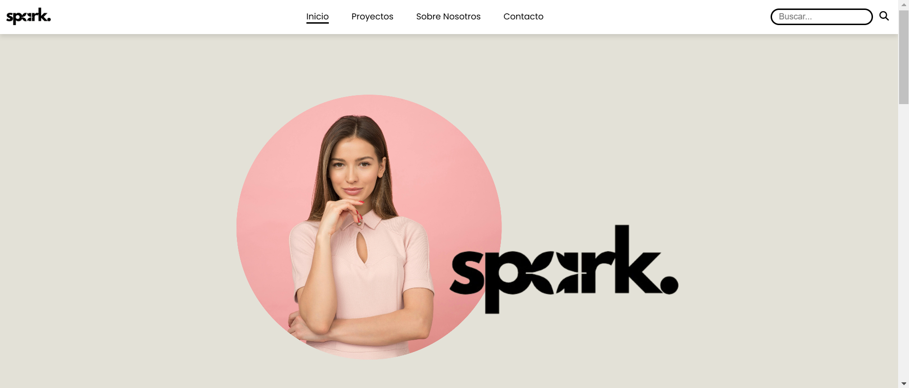

#SPARK AGENCY - PROYECTO HTML5, CSS3 Y JAVASCRIPT

## 🚀 Características

- **Diseño responsive**: Se adapta a diferentes tamaños de pantalla para una mejor experiencia de usuario.
- **Interactividad**: Existen varios elementos interactivos en la página como un Botón de Scroll vertical, un Buscador interno en el cual podemos buscar los diferentes proyectos realizados y varios efectos animados creados con Javascript.
- **Cards Interactivas** : Estas cards interactivas o Flip Cards, son tarjetas con información sobre los casos de éxito de la página.

## 🌐 Tecnologías utilizadas

- **HTML5**: Para la estructura del contenido.
- **CSS3**: Para el estilo y diseño.
- **JS**: Para elementos interactivos
- **Font Awesome**: Para iconos modernos y elegantes.

  📧 Contacto
Si tienes preguntas o comentarios, no dudes en contactar.
Email: judithfullstack@gmail.com

